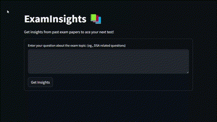
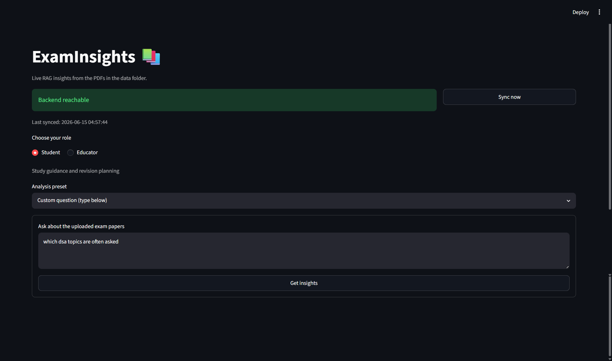

# ExamInsights: Live RAG for Exam Paper Analysis

ExamInsights helps students and educators analyze past exam papers with a Pathway-powered RAG backend and a Streamlit interface. Drop PDFs into the `data/` folder, ask role-specific questions, and get study or curriculum insights from the indexed papers.

The current milestone focuses on local real-time ingestion: Pathway watches the `data/` folder in streaming mode, tracks PDF additions, updates, and deletions, and keeps metadata such as source path and modified time available to the retrieval pipeline.

### What It Does

- Watches `data/*.pdf` for live local updates.
- Runs a Pathway vector-store RAG backend on port `8000`.
- Runs a Streamlit UI on port `8501`.
- Provides Student and Educator modes with reusable prompt presets.
- Shows backend reachability and the last UI status check.
- Supports Docker and Render-style container deployment.

### Architecture

- **Pathway** ingests PDFs, parses document content, embeds chunks, and serves the RAG endpoint.
- **Streamlit** provides the role selector, prompt presets, custom question box, backend status check, and answer display.
- **LiteLLM/Gemini** powers answer generation through the configured model in `config.yaml`.
- **Docker** runs the backend and frontend together for local use or hosted deployment.

### Prerequisites

Before you begin, ensure you have the following:

- **Python 3.10+** (if running without Docker)
- **Docker** (if running containerized)
- **Gemini API Key** (or another LLM provider supported by LiteLLM)

### Configuration

Create a `.env` file with your LLM provider credentials:

```bash
GEMINI_API_KEY=your_key_here
```

Optional Streamlit settings:

```bash
EXAMINSIGHTS_API_URL=http://localhost:8000/v1/pw_ai_answer
EXAMINSIGHTS_TIMEOUT_SECONDS=45
```

The local source is configured in `config.yaml`:

```yaml
sources:
  - name: local_files
    kind: local
    config:
      path: "data/"
      mode: "streaming"
      object_pattern: "*.pdf"
      autocommit_duration_ms: 1500
```

Google Drive and SharePoint examples remain in `config.yaml` as future connector options.

### Run Locally With Docker

```bash
docker build -t examinsights .
docker run --env-file .env -p 8000:8000 -p 8501:8501 examinsights
```

Open the Streamlit app at:

```text
http://localhost:8501
```

### Run Without Docker

> **Note for Windows users:** The Pathway framework natively requires a Linux or macOS environment. If you are on Windows, we highly recommend using the **Run Locally With Docker** approach above. Alternatively, you can run the following commands inside **WSL 2 (Windows Subsystem for Linux)**.

If you are in WSL, use the Linux-style virtual environment path, not `\`:

```bash
source .venv/bin/activate
```

If `.venv` only has `Scripts/activate`, then it was created as a Windows virtual environment and will not activate properly in WSL. In that case, recreate it in WSL:

```bash
python3 -m venv .venv
source .venv/bin/activate
```

You should then see `(.venv)` in the prompt.

Install dependencies:

```bash
pip install -r requirements.txt
```

Start the Pathway backend:

```bash
python app.py
```

In a second terminal, start Streamlit:

```bash
streamlit run streamlit_app.py
```

### Using The App

1. Add exam-paper PDFs to the `data/` folder.
2. Start the backend and Streamlit UI.
3. Choose **Student** or **Educator** mode.
4. Select an analysis preset or type your own question.
5. Use **Sync now** to check backend reachability and refresh the UI status.

Student mode focuses on study guidance, likely topics, weak-area revision, and answer preparation. Educator mode focuses on topic frequency, curriculum coverage, repeated question patterns, and assessment gaps.

### Render Deployment

Use the Dockerfile as the Render service build path:

- Service type: Web Service
- Runtime: Docker
- Exposed web port: `8501`
- Environment variables: set `GEMINI_API_KEY` and optionally `EXAMINSIGHTS_TIMEOUT_SECONDS`
- Keep `EXAMINSIGHTS_API_URL` unset unless the backend is split into a separate service; the default container-local URL is suitable when both processes run in one container.

The Docker command starts both services and binds Streamlit to the container network:

```bash
python app.py & streamlit run streamlit_app.py --server.address=0.0.0.0 --server.port=8501
```

### Demo



### Screenshots

**Student Mode Analysis**


**Educator Curriculum Insights**


**Live Backend Sync Status**


### Troubleshooting

- **Backend Unreachable:** Ensure the Pathway backend is fully started and running on port `8000`. Use the "Sync now" button in the UI to check. If using custom ports, update `EXAMINSIGHTS_API_URL` accordingly.
- **Empty Responses / LLM Errors:** Check that your `GEMINI_API_KEY` is valid and properly loaded from the `.env` file.
- **No Data Retrieved:** Verify that your `.pdf` files are inside the `data/` folder and that Pathway has had time to ingest them.

### Project Notes

This project began as a MuLearn LLM and RAG workshop prototype and now targets a more live educational workflow. The first production-facing improvement is local streaming ingestion; external connectors such as Google Drive can be added after credentials and hosting needs are finalized.
